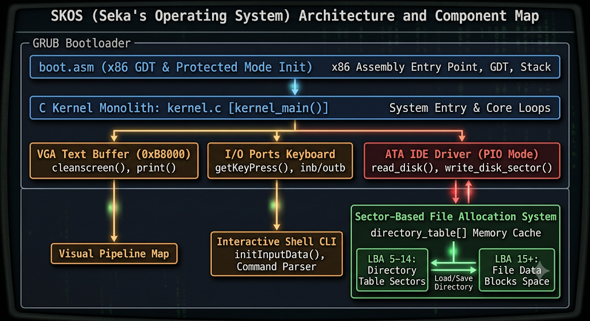
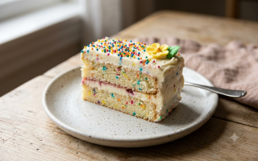
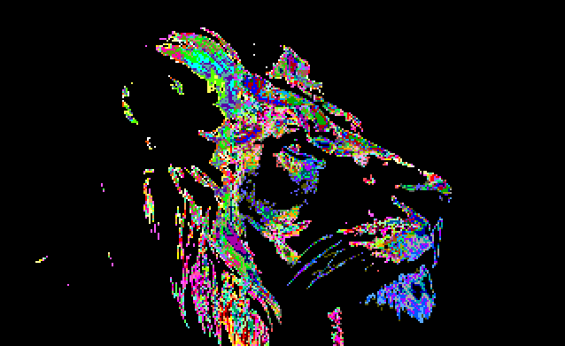
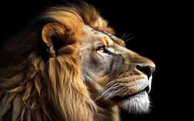
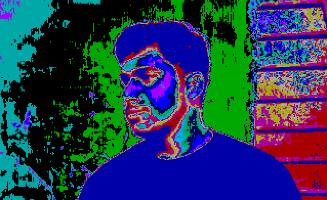

<div align="center">

# SKOS — Seka Operating System

**A hobby 32-bit x86 OS with a VGA text shell, 320×200 graphics mode, keyboard driver, and sector-based file system.**

<br>

<video src="os.mp4" controls width="720">
  Your browser does not support embedded video. <a href="os.mp4">Download os.mp4</a>
</video>

<br>

*Boot demo — SKOS running in QEMU/VirtualBox*

</div>

---

## Overview

SKOS is a from-scratch operating system written in **C** and **x86 assembly**. GRUB loads the Multiboot kernel, which brings up a VGA text console, can switch to **320×200×256** graphics mode, polls the keyboard via I/O ports, and talks to an ATA IDE disk in PIO mode. A lightweight on-disk file system stores up to **256 files** across dedicated directory and data sectors. Six embedded bitmaps can be viewed at runtime from the shell.

| Layer | Technology |
|-------|------------|
| Bootloader | GRUB 2 (Multiboot) |
| Entry | `boot.asm` — stack setup, calls `kernel_main()` |
| Kernel | `kernel.c` — monolithic, freestanding C |
| Text display | VGA text mode buffer at `0xB8000` |
| Graphics | VGA mode 13h — framebuffer at `0xA0000`, `draw_image()` |
| Input | PS/2 keyboard via ports `0x60` / `0x64` |
| Storage | ATA PIO — `read_disk()` / `write_disk_sector()` |
| Assets | PNG → `img.py` → C pixel arrays embedded in `kernel.c` |
| Image | `grub-mkrescue` → `skos.iso` |

---

## Architecture

<p align="center">
  
</p>

### Boot flow

```
GRUB (Multiboot)
      │
      ▼
boot.asm ──► sets ESP, calls kernel_main()
      │
      ▼
kernel.c
      ├── cleanscreen() / print()          → VGA 0xB8000
      ├── load_directory()                 → LBA 5–14
      ├── format_disk_directory()          → first-boot init
      └── initInputData()                  → interactive shell loop
              │
              ├── getKeyPress()            → keyboard I/O
              └── command parser
                      ├── makefile / read / list / del
                      ├── clear / display / loop / help
                      ├── guion → enter_graphics_environment()
                      ├── showimg / view [name] → embedded SKOS_Image[]
                      └── creatediskfile() → ATA write LBA 15+
```

### Disk layout

| LBA range | Purpose |
|-----------|---------|
| `0–4` | Boot / reserved |
| `5–14` | Directory table (10 sectors, 256 `FileEntry` records) |
| `15+` | File data blocks (one sector per file slot) |

```c
struct FileEntry {
    char     name[12];
    uint32_t start_lba;
    uint32_t is_used;
};
```

---

## Shell commands

| Command | Description |
|---------|-------------|
| `clear` | Wipe the VGA screen |
| `display 'text'` | Print quoted text to the console |
| `makefile <name>` | Create a file (interactive content prompt, max ~200 chars) |
| `read <name>` | Read and display a file from disk |
| `list` | List all file names in the directory table |
| `del` | Wipe the entire directory (format) |
| `loop <n> <text>` | Repeat text `n` times (1–1999) |
| `guion` | Switch to 320×200 graphics demo; press **q** to return to text mode |
| `showimg` | List all embedded image names |
| `view <image>` | Render an embedded image fullscreen; press **q** to exit |
| `help` | Show available commands |

### Embedded images (`showimg` / `view`)

Run `showimg` in the shell to list names, then `view <name>` to display one. Press **q** to return to the text shell.

| Image name | Size | Source asset |
|------------|------|--------------|
| `logo.skimg` | 16×16 | Built-in sample |
| `box.skimg` | 4×4 | Built-in sample |
| `cake.skimg` | 320×200 | `cake.png` / `me1.png` |
| `sun.skimg` | 320×199 | `sun.png` |
| `lion.skimg` | 320×199 | `lion.png` |
| `sabihkhan.skimg` | 320×199 | `person.png` |

```bash
> showimg
listing images ....
logo.skimg
box.skimg
cake.skimg
sun.skimg
lion.skimg
sabihkhan.skimg

> view sun.skimg
# fullscreen graphics — press q to quit
```

---

## Asset gallery

Source PNGs used to build embedded kernel bitmaps (via `img.py`):

<p align="center">
  
  
  
  
  
  
</p>

To convert a new PNG into a C pixel array for the kernel:

```bash
python3 img.py   # reads me1.png, writes imgdata.txt
# paste the generated array into kernel.c and register it in embedded_images[]
```

---

## Build & run

### Prerequisites

- `nasm` — assemble `boot.asm`
- `gcc` (32-bit) — `gcc-multilib` on 64-bit Linux
- `ld` — ELF32 linker
- `grub-pc-bin` + `xorriso` — ISO creation
- QEMU or VirtualBox — run the image

### Quick start

```bash
chmod +x run.sh
./run.sh
```

`run.sh` assembles, compiles, links, copies the kernel into `iso_root/`, and builds `skos.iso`.

### Run in QEMU

```bash
qemu-system-i386 -cdrom skos.iso -hda storage.img
```

### Run in VirtualBox

Attach `skos.iso` as the optical drive and `storage.vdi` (or `storage.img`) as the hard disk.

---

## Project structure

```
├── boot.asm              # Multiboot header, stack, _start → kernel_main
├── boot.o                # Assembled boot object
├── cake.png              # Source art → cake.skimg
├── cal.js                # Misc. scratch file
├── disk.bin              # Raw disk image (1 MB)
├── disk.img              # Larger disk image (64 MB)
├── function.txt          # Notes / snippets for directory I/O
├── harddisk.img          # 10 MB disk image
├── img.py                # PNG → VGA palette C array converter
├── imgdata.txt           # Generated pixel data from img.py
├── iso_root/
│   └── boot/
│       ├── grub/
│       │   └── grub.cfg  # GRUB menuentry → mykernel.bin
│       └── mykernel.bin  # Kernel binary (copied at build time)
├── kernel.c              # Main kernel — VGA, graphics, keyboard, ATA, shell, FS
├── kernel.o              # Compiled kernel object
├── linker.ld             # Link script — kernel loaded at 1 MB
├── lion.png              # Source art → lion.skimg
├── lion2.png             # Alternate lion asset
├── me1.png               # Source art for img.py / cake.skimg
├── mykernel.bin          # Linked kernel binary
├── os.mp4                # Boot / demo recording
├── person.png            # Source art → sabihkhan.skimg
├── run.sh                # One-shot build script
├── skos.iso              # Bootable ISO (GRUB + kernel)
├── storage.img           # Persistent storage for QEMU
├── storage.vdi           # VirtualBox disk format
├── structure.png         # Architecture diagram
└── sun.png               # Source art → sun.skimg
```

---

## Key source files

| File | Role |
|------|------|
| [`boot.asm`](boot.asm) | x86 entry — Multiboot magic, 16 KB stack, `call kernel_main` |
| [`kernel.c`](kernel.c) | VGA text/graphics, `draw_image()`, embedded images, shell, file system |
| [`img.py`](img.py) | Converts PNG assets to 256-color VGA pixel arrays |
| [`linker.ld`](linker.ld) | Places `.multiboot`, `.text`, `.data`, `.bss` at 1 MB |
| [`iso_root/boot/grub/grub.cfg`](iso_root/boot/grub/grub.cfg) | GRUB boot entry for SKOS |
| [`run.sh`](run.sh) | `nasm` → `gcc -m32 -ffreestanding` → `ld` → `grub-mkrescue` |

---

## License

Hobby / educational project — use and learn freely.
